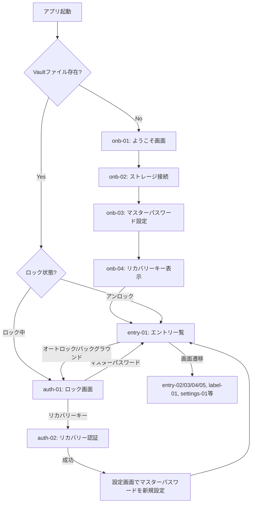

# kura 画面設計

## 1. 概要

本ドキュメントは、kuraの全クライアント（iOS/Android/ブラウザ拡張/デスクトップ）で必要な17個の画面を設計し、vault_core APIとの対応関係を明文化したものです。設計原則はCLAUDE.mdの「デザイン コンテキスト」に準拠し、シンプルで効率的なインターフェースを目指します。

### 対応プラットフォーム
- iOS / Android（Flutter）
- ブラウザ拡張（Chrome / Firefox、TypeScript）
- デスクトップアプリ（将来対応）

### 画面ID命名規則
- `onb-01` など、プレフィックス+連番
- プレフィックス：`onb`（オンボーディング）/ `auth`（認証）/ `entry`（エントリ管理）/ `sync`（同期）/ `label`（ラベル）/ `settings`（設定）/ `ext`（拡張機能固有）

---

## 2. 共通コンポーネント

### 2.1 コピーボタン + クリップボードタイマー
- パスワード、ユーザー名など機密フィールドの横にコピーボタンを配置
- コピー後、「コピーしました」表示を2秒表示
- その後、30秒（デフォルト、設定で変更可能）でクリップボードをクリア
- クリップボードクリアの可否は設定で制御可能（有効化/無効化）

### 2.2 機密フィールドの表示/非表示トグル
- パスワード、PIN、秘密鍵など、テキスト入力フィールドの右端に目アイコンを配置
- 目アイコン：表示時は目を開いた状態、非表示時は斜線付き

### 2.3 同期状態インジケーター
- モバイル：ステータスバーの右上に同期状態を表示（アイコン+テキスト）
- ブラウザ拡張：ポップアップの上部に同期状態を表示
- 状態：「同期中」/ 「同期完了」/ 「同期エラー」/ 「オフライン」

---

## 3. ナビゲーション構造

### 3.1 起動フロー（Mermaid図）

### 3.2 モバイル（Flutter）ナビゲーション
- BottomNavigationBar：3タブ構成
  - 📋 エントリ（entry-01の起点）
  - ⭐ お気に入り（entry-01の`favorites_only`フィルター版）
  - ⚙️ 設定（settings-01）
- ナビゲーションドロワー（オプション）：ゴミ箱、ラベル一覧へのアクセス

### 3.3 ブラウザ拡張（TypeScript）ナビゲーション
- ポップアップ内（300×600px程度）に2画面構成
  - メイン：entry-01（エントリ一覧）
  - サイドパネル：entry-02（詳細）/ settings-01（設定）
- ハンバーガーメニュー：ラベル、ゴミ箱、拡張メニュー

---

## 4. 画面詳細

### onb-01: ようこそ画面
**目的：** kuraの概要説明とオンボーディングの起点
**呼び出しvault_core API：** なし
**主要コンポーネント：**
- ブランドロゴ
- 3〜4行の説明テキスト（「サーバ不要、自分一人のための〜」）
- 「次へ進む」ボタン → onb-02へ
- プラットフォーム選択（初回のみ）

**インタラクション：** ボタンのみ。複雑な操作なし。

---

### onb-02: ストレージ接続画面
**目的：** AWS S3 / Cloudflare R2等のストレージ設定
**呼び出しvault_core API：** `VaultConfig`の設定（直接呼び出しなし、UIで設定値を構築）
**主要コンポーネント：**
- ストレージサービス選択：S3 / Cloudflare R2 / MinIOのラジオボタン
- テキストフィールド：
  - エンドポイント URL
  - Access Key ID
  - Secret Access Key
  - バケット名
  - リージョン（S3の場合のみ）
- 「接続テスト」ボタン：接続確認（vault_coreの`StorageBackend::download()`を呼び出す）
- 「次へ進む」ボタン → onb-03へ

**インタラクション：** テキスト入力、ラジオボタン選択、非同期接続テスト

---

### onb-03: マスターパスワード設定画面
**目的：** マスターパスワード設定と確認
**呼び出しvault_core API：** `LockedVault::create_new(master_password)`
**主要コンポーネント：**
- テキストフィールド（パスワード非表示）：「マスターパスワード」
  - 表示/非表示トグル
  - 強度インジケーター（弱/中/強）
- テキストフィールド：「パスワード確認」
  - 表示/非表示トグル
  - 入力値が一致すると「✓」を表示
- チェックボックス：「このパスワードを忘れないことを確認します」（必須）
- 「作成」ボタン → onb-04へ、あるいは入力エラー時に赤いエラーメッセージ

**インタラクション：** テキスト入力、チェックボックス、同期的バリデーション

---

### onb-04: リカバリーキー表示・確認画面
**目的：** リカバリーキーの表示と確認。オンボーディングの最終ステップ
**呼び出しvault_core API：** `LockedVault::create_new()`の戻り値に含まれる`RecoveryKey`
**主要コンポーネント：**
- 警告テキスト：「このキーを失うと復旧不可能です」
- リカバリーキー表示：
  - Base32エンコード、4文字ごとにダッシュ区切り
  - （例：`ABCD-EFGH-IJKL-MNOP`）
  - モノスペースフォント
- 「コピー」ボタン
- 「印刷」ボタン（モバイル以外）
- 「紙に書き写しました」チェックボックス（確認用）
- 「リカバリーキーを確認」セクション：
  - リカバリーキーの一部を隠し、ユーザーに入力させて確認
  - ダッシュ自動挿入フォーマッター
- 「完了」ボタン → entry-01へ

**インタラクション：** コピー、テキスト入力、バリデーション

---

### auth-01: ロック画面
**目的：** マスターパスワード入力によるアンロック
**呼び出しvault_core API：** `LockedVault::unlock(master_password)`
**主要コンポーネント：**
- ブランドロゴ / ロック状態を示すビジュアル
- テキスト：「kuraはロックされています」
- テキストフィールド（パスワード非表示）：「マスターパスワード」
  - 表示/非表示トグル
- 「ロック解除」ボタン → 成功時entry-01へ、失敗時エラーメッセージ
- 「リカバリーキーで復旧」リンク → auth-02へ
- （オプション）バイオメトリクス認証ボタン（iOS/Android）

**インタラクション：** パスワード入力、非同期アンロック処理、エラーハンドリング

---

### auth-02: リカバリーキー認証画面
**目的：** マスターパスワード忘却時、リカバリーキーで新しいマスターパスワードを設定
**呼び出しvault_core API：**
  - `LockedVault::unlock_with_recovery_key(recovery_key)`
  - その後、`UnlockedVault::change_master_password(old_password, new_password)`を呼び出し（old_passwordはダミー）
**主要コンポーネント：**
- テキストフィールド：「リカバリーキーを入力」
  - ダッシュ自動挿入フォーマッター
  - バリデーション表示
- 「次へ進む」ボタン → マスターパスワード再設定フロー（onb-03と同じUI）
- 「マスターパスワードを思い出した」リンク → auth-01へ戻る

**インタラクション：** テキスト入力、フォーマッター、バリデーション、非同期復号

---

### entry-01: エントリ一覧画面
**目的：** パスワードエントリの表示・フィルター・検索
**呼び出しvault_core API：** `UnlockedVault::list_entries(filter)`
**主要コンポーネント：**
- 検索バー：`EntryFilter.search_query`で実装
- フィルタータブ：
  - 「すべて」（デフォルト）
  - 「ログイン」`EntryFilter.with_type(EntryType::Login)`
  - 「銀行」`EntryFilter.with_type(EntryType::Bank)`
  - 「セキュアノート」等
- ラベル絞り込み：ドロップダウン `EntryFilter.with_label(label_id)`（単一選択のみ）
  - 注）複数ラベル同時フィルターはAPIで未サポート
- リスト：各エントリを名前、種別アイコン、更新日で表示
  - 左に★アイコン（お気に入り判定）
  - スワイプまたはコンテキストメニュー：編集・削除・詳細表示
- フローティングボタン（+）：entry-04へ（新規作成）
- 下部：同期状態インジケーター

**インタラクション：** 検索テキスト入力、フィルター選択、リストスクロール、エントリタップで詳細へ

---

### entry-02: エントリ詳細表示画面
**目的：** エントリの全情報を読み取り専用で表示
**呼び出しvault_core API：** `UnlockedVault::get_entry(id)`
**主要コンポーネント：**
- ヘッダー：エントリ名、種別アイコン
- 読み取り専用フィールド：
  - type別の項目（ログインなら URL/ユーザー名/パスワード/TOTP）
  - 各フィールドの横に「コピー」ボタン（クリップボードタイマー機能）
  - パスワード等は デフォルト非表示、目アイコンで表示切り替え
- ラベル表示：ラベル名を並べて表示
- 更新日時
- お気に入り★ボタン（`UnlockedVault::set_favorite()`でトグル）
- アクションボタン：
  - 「編集」→ entry-03へ
  - 「削除」→ 確認ダイアログ → `UnlockedVault::delete_entry()`でゴミ箱へ移動
  - 「ゴミ箱から削除」（trash内のエントリの場合）→ `UnlockedVault::purge_entry()`で完全削除
- ブラウザ拡張専用（ext-01参照）：
  - 「このサイトで自動入力」ボタン

**インタラクション：** コピー、表示切り替え、お気に入りトグル、非同期削除・復元

---

### entry-03: エントリ編集画面
**目的：** 既存エントリの内容変更
**呼び出しvault_core API：** `UnlockedVault::update_entry(id, name, data)`
**主要コンポーネント：**
- entry-04と同じ入力フォーム（但し既存値をプリフィル）
- ヘッダー：「編集」
- 「保存」ボタン → entry-01へ、またはentry-02へ（画面遷移元による）
- 「キャンセル」ボタン → 確認ダイアログ（未保存変更がある場合）→ 戻る

**インタラクション：** テキスト入力、フィールド動的表示（type別）、非同期保存

---

### entry-04: エントリ新規作成画面
**目的：** 新しいエントリを作成
**呼び出しvault_core API：** `UnlockedVault::create_entry(name, entry_type, data, label_ids)`
**主要コンポーネント：**
- 種別選択タブ：Login / Bank / SSH Key / Secure Note / Credit Card / Passkey（非実装）
- テキストフィールド：「エントリ名」（必須）
- 種別別の入力フィールド：
  - **Login**：URL / ユーザー名 / パスワード（+生成ボタン） / TOTP / 備考
  - **Bank**：銀行名 / 口座番号 / PIN / 備考
  - **SSH Key**：秘密鍵 / パスフレーズ / 備考
  - **Secure Note**：コンテンツ / 備考
  - **Credit Card**：カード名義 / 番号 / 有効期限 / CVV / 備考
- パスワード生成ボタン → entry-06モーダル表示
- ラベル選択（複数可）：チェックボックス一覧、または `label-01` で新規作成
- 「作成」ボタン → entry-01へ（あるいはentry-02で詳細表示）
- 「キャンセル」ボタン → 確認ダイアログ → entry-01へ

**インタラクション：** テキスト入力、種別ラジオ切り替え（フォーム動的変更）、ラベルチェックボックス、非同期作成

---

### entry-05: ゴミ箱画面
**目的：** 削除済みエントリの表示と復元・完全削除
**呼び出しvault_core API：**
  - `EntryFilter.with_trash(true)` で削除済みエントリのみ取得
  - `UnlockedVault::restore_entry(id)` で復元
  - `UnlockedVault::purge_entry(id)` で完全削除
**主要コンポーネント：**
- entry-01と同様のリスト表示（削除済みエントリのみ）
- 削除日時を併記
- アクション：
  - 「復元」→ `restore_entry()` → entry-01へ戻る
  - 「完全削除」→ 確認ダイアログ → `purge_entry()` → リストから削除
  - 「空にする」ボタン：全削除エントリを一括完全削除

**インタラクション：** リストスクロール、復元・削除ボタン、確認ダイアログ

---

### entry-06: パスワード生成モーダル
**目的：** 強力なパスワードの生成
**呼び出しvault_core API：** `generate_password(options)`（vault_coreに追加予定）
**主要コンポーネント：**
- スライダー：パスワード長（8〜32文字、デフォルト16）
- チェックボックス：
  - 大文字を含む（デフォルト ON）
  - 小文字を含む（デフォルト ON）
  - 数字を含む（デフォルト ON）
  - 記号を含む（デフォルト ON）
  - 曖昧な文字を避ける（0/O/l/1等、デフォルト ON）
- 生成されたパスワード表示（モノスペース）
  - 「コピー」ボタン
  - 「再生成」ボタン
- 「使用」ボタン → entry-04のパスワードフィールドに自動入力、モーダルを閉じる
- 「キャンセル」ボタン

**インタラクション：** スライダー・チェックボックス操作で即座に再生成、非同期生成処理

---

### sync-01: 同期状態画面
**目的：** 同期ステータスの表示と手動同期トリガー
**呼び出しvault_core API：** `UnlockedVault::sync(storage)`
**主要コンポーネント：**
- 現在の同期状態表示：
  - 最終同期時刻
  - 成功 / エラー / オフライン状態
  - エラーメッセージ（あれば）
- 「今すぐ同期」ボタン → 非同期`sync()`実行
  - 実行中：プログレスバー / スピナー表示
  - 成功：「✓ 同期しました」表示
  - エラー：エラーメッセージ + リトライボタン
  - コンフリクト：sync-02へ遷移
- デバイス一覧（概要のみ）：複数デバイス間で同期していることを視覚的に示す

**インタラクション：** ボタンクリックで非同期同期実行、エラーハンドリング

---

### sync-02: コンフリクト解消画面
**目的：** データの競合をユーザーに提示し、解決戦略を選択させる
**呼び出しvault_core API：**
  - `SyncResult::conflicts` からコンフリクト一覧を取得
  - `UnlockedVault::resolve_conflict(conflict_id, resolution)`で各コンフリクトを解決
  - その後、再度`UnlockedVault::sync()`で完全同期
**主要コンポーネント：**
- 警告テキスト：「複数デバイスで同時に編集されました」
- コンフリクト一覧（カード形式）：各エントリごとに
  - エントリ名
  - コンフリクトタイプ表示：
    - `both_modified`：「ローカルとリモートで異なる内容」
    - `deleted_remote`：「このデバイスのみに存在（リモートで削除）」
    - `deleted_local`：「リモートのみに存在（このデバイスで削除）」
  - ローカル版 / リモート版を左右またはタブで表示
  - ラジオボタン選択肢（3択）：
    - 「このデバイスのバージョンを使用」 → `UseLocal`
    - 「別のデバイスのバージョンを使用」 → `UseRemote`
    - 「削除する」 → `DeleteEntry`
- 「解決」ボタン → 全コンフリクトの解決を確認、再度sync()を実行
- 「キャンセル」ボタン → entry-01へ戻る（コンフリクト未解決）

**インタラクション：** ラジオボタン選択、非同期コンフリクト解決、複数ダイアログ処理

---

### label-01: ラベル管理画面
**目的：** ラベルの表示・作成・編集・削除
**呼び出しvault_core API：**
  - `UnlockedVault::list_labels()` でラベル一覧取得
  - `UnlockedVault::create_label(name)` で新規作成
  - `UnlockedVault::set_entry_labels(entry_id, label_ids)` でエントリに紐付け（編集時）
**主要コンポーネント：**
- ラベル一覧（リスト形式）：
  - ラベル名
  - そのラベルに紐付いたエントリ数表示
  - 右スワイプまたはコンテキストメニュー：
    - 「使用中のエントリを表示」→ entry-01で該当ラベルフィルター
    - 「編集」→ 名前変更ダイアログ
    - 「削除」→ 確認ダイアログ（エントリからラベルを外すのみ、エントリ自体は削除しない）
- 「新しいラベルを作成」セクション：
  - テキストフィールド：「ラベル名」
  - 「作成」ボタン → `create_label()` → リストに追加

**インタラクション：** リストスクロール、テキスト入力、確認ダイアログ、非同期CRUD操作

---

### settings-01: 設定画面（統合）
**目的：** 全設定項目を1画面に集約
**呼び出しvault_core API：**
  - `UnlockedVault::change_master_password()`
  - `UnlockedVault::upgrade_argon2_params()`
  - `UnlockedVault::rotate_dek()`
  - `UnlockedVault::regenerate_recovery_key()`
  - `UnlockedVault::lock()` でロック
**主要コンポーネント：**

**セクション1：セキュリティ**
- 「マスターパスワードを変更」ボタン：
  - ダイアログで現在のパスワード入力、新パスワード入力（×2）
  - `change_master_password(old, new)` → 完了メッセージ
- 「パスワード強度パラメータをアップグレード」ボタン：
  - ダイアログで新Argon2パラメータ選択（現在値 → 推奨値への変更）
  - `upgrade_argon2_params(password, new_params)` → 完了メッセージ
  - 処理時間が長い可能性を警告
- 「DEK（暗号化鍵）をローテーション」ボタン：
  - 警告メッセージ「全エントリを再暗号化します。時間がかかります」
  - 確認ダイアログ
  - `rotate_dek()` → プログレスバー表示 → 完了
- 「リカバリーキーを再発行」ボタン：
  - マスターパスワード入力ダイアログ
  - `regenerate_recovery_key()` → 新キーを表示（onb-04と同じUI）

**セクション2：動作設定**
- トグル：「クリップボード自動クリア」（有効/無効）
  - 有効時：スライダーで秒数設定（10〜300秒、デフォルト30秒）
- トグル：「オートロック有効」（有効/無効）
  - 有効時：スライダーで分数設定（1〜60分、デフォルト5分）
  - オプション：「バックグラウンド移行時に即座にロック」チェックボックス
- トグル：「スクリーンショット防止」（デバイスが対応している場合）

**セクション3：ストレージ**
- 現在のストレージ設定表示（読み取り専用）
- 「ストレージ設定を変更」ボタン → onb-02と同じUIダイアログ
- 「容量使用量」表示（オプション）

**セクション4：ユーティリティ**
- 「このデバイスをロック」ボタン → `lock()` → auth-01へ遷移
- 「ローカルキャッシュをクリア」ボタン → 確認 → オフラインキャッシュを削除
- バージョン情報表示

**インタラクション：** トグル・スライダー操作で即座に保存、ボタンクリックでダイアログ表示、非同期処理表示

---

### ext-01: [ブラウザ拡張固有] 自動入力候補選択
**目的：** ブラウザでフォーム検出時に、該当するエントリを候補として提示し、自動入力を実行
**呼び出しvault_core API：**
  - `UnlockedVault::list_entries(filter)` でURL一致するエントリを検索
  - `UnlockedVault::get_entry(id)` で詳細を取得
**主要コンポーネント：**
- ポップアップ内の専用UI：
  - 自動検出されたサイトURL表示
  - 該当エントリの候補リスト（複数該当する場合）
    - エントリ名
    - ユーザー名プレビュー（最初の数文字）
  - タップで該当エントリを選択
- 自動入力処理：
  - ユーザー名フィールドに自動入力
  - パスワードフィールドに自動入力
  - TOTP対応の場合：TOTPコードを生成して自動入力（一部サイトのみ、設定で制御）
- フォーム検出ルール：
  - ヒューリスティック検出（汎用）
  - パターンDB対応（サイト固有ルール、GitHubで公開・更新）

**インタラクション：** 自動検出 → 候補選択 → 自動入力完了

---

## 5. vault_core API 対応表

| API（UnlockedVaultメソッド） | 使用画面 | 主要処理 |
|---|---|---|
| `list_entries(filter)` | entry-01, entry-05, sync-01, ext-01 | エントリ一覧取得（フィルター対応） |
| `get_entry(id)` | entry-02, ext-01 | エントリ詳細取得・復号 |
| `create_entry(name, type, data, label_ids)` | entry-04 | エントリ作成 |
| `update_entry(id, name, data)` | entry-03 | エントリ更新 |
| `delete_entry(id)` | entry-02, entry-05 | エントリソフト削除（ゴミ箱へ） |
| `restore_entry(id)` | entry-05 | エントリ復元 |
| `purge_entry(id)` | entry-02, entry-05 | エントリ完全削除 |
| `set_favorite(id, is_favorite)` | entry-02 | お気に入り設定 |
| `list_labels()` | label-01 | ラベル一覧取得 |
| `create_label(name)` | label-01 | ラベル作成 |
| `set_entry_labels(entry_id, label_ids)` | entry-04, entry-03, label-01 | エントリにラベルを紐付け |
| `change_master_password(old, new)` | settings-01 | マスターパスワード変更 |
| `upgrade_argon2_params(password, new_params)` | settings-01 | Argon2パラメータ強化 |
| `rotate_dek()` | settings-01 | DEKローテーション |
| `regenerate_recovery_key(password)` | settings-01 | リカバリーキー再発行 |
| `push(storage)` | 同期完了後（UI表示なし） | ローカル変更をS3へ推送 |
| `sync(storage)` | sync-01 | リモートと同期、コンフリクト検出 |
| `resolve_conflict(conflict_id, resolution)` | sync-02 | コンフリクト解決 |
| `lock()` | settings-01（「ロック」ボタン）、オートロック | Vaultをロック（DEKをメモリから消去） |
| `get_recovery_key(password)` | settings-01（「リカバリーキーを表示」） | リカバリーキー表示（実装予定） |

| API（LockedVaultメソッド） | 使用画面 | 主要処理 |
|---|---|---|
| `create_new(master_password)` | onb-03 | 新規Vault作成 |
| `unlock(master_password)` | auth-01 | マスターパスワードでアンロック |
| `unlock_with_recovery_key(recovery_key)` | auth-02 | リカバリーキーでアンロック |

| API（ユーティリティ） | 使用画面 | 主要処理 |
|---|---|---|
| `generate_password(options)` | entry-06 | パスワード生成 |
| `generate_totp(secret, digits, period)` | entry-02（TOTP表示時）、ext-01（自動入力時） | TOTPコード生成 |
| `generate_totp_default(secret)` | entry-02（TOTP表示時）、ext-01（自動入力時） | TOTPコード生成（デフォルト設定） |

---

## 6. 実装上の注意事項

### 6.1 EntryFilterの制約
- `label_id` フィールドは `Option<String>` で、**単一ラベルのみフィルター可**
- 複数ラベル同時フィルターはAPIレベルで未サポート
- UIでは「ラベル選択」をドロップダウン1つに制限し、複数選択を許さない
- ただし、エントリ自体は複数ラベルを保持可能

### 6.2 RecoveryKeyの表示形式
- Base32エンコード、4文字ごとにダッシュ区切り（例：`ABCD-EFGH-IJKL-MNOP`）
- 変換メソッド：`RecoveryKey::to_display_string()` / `from_display_string()`
- 入力UIはダッシュ自動挿入フォーマッター実装（ユーザーがダッシュを入力しなくても自動削除）

### 6.3 TOTP生成
- vault_core API：
  - `generate_totp(secret: &str, digits: u32, period: u64) -> Result<String>` - カスタム設定でTOTPコード生成
  - `generate_totp_default(secret: &str) -> Result<String>` - デフォルト設定（6桁、30秒周期）でTOTPコード生成
  - 戻り値：ゼロ埋め済みの TOTP コード文字列（例: "012345"）
- entry-02詳細画面：
  - TOTP秘密鍵が存在する場合のみTOTPセクションを表示
  - クライアント側で定期的（1秒ごと）にコードを再生成して表示
  - 残り有効時間をプログレスバーで表示（サーバーサイド時刻ベース）
- ext-01自動入力：
  - サイトがTOTP対応で、エントリに秘密鍵がある場合のみ生成
  - `generate_totp_default()` を呼び出してコードを生成し、自動入力

### 6.4 ConflictResolutionの3択
- `UseLocal`：ローカルの現在値を採用
- `UseRemote`：リモートの値を採用
- `DeleteEntry`：エントリを完全削除
- sync-02画面でラジオボタン3択として提示

### 6.5 スクリーンショット防止
- iOS / Android：OS機能の利用（Window.setFlags(FLAG_SECURE)など）
- ブラウザ拡張：chrome.tabsのcaptureVisibleTab防止（manifest.jsonで権限制限）
- settings-01で ON/OFF 設定可能

### 6.6 オートロック実装
- settings-01で有効/無効 + 時間設定（分単位）
- バックグラウンド移行時に即座ロック（有効時）
- アプリ再起動・オートロック時間超過で auth-01へ

### 6.7 ToastメッセージとDialog
- 短期メッセージ（2秒）：「コピーしました」「同期しました」
- 確認ダイアログ：削除・コンフリクト解決など、取り消し不可な操作時に表示
- エラーダイアログ：API失敗時、詳細メッセージ + リトライ/キャンセルボタン

### 6.8 ブラウザ拡張のMV3対応
- manifest.json v3 で remoteCode の動的フェッチが制限される
- パターンDB（フォーム検出ルール）はビルド時に同梱
- バックグラウンドで週次更新試行、失敗時は最後に取得済みのファイルにフォールバック

### 6.9 プラットフォーム別のナビゲーション実装
- **モバイル（Flutter）**
  - BottomNavigationBar で3タブ管理
  - タブ切り替え時に画面遷移スタックをリセット（タブごと独立）
- **ブラウザ拡張（TypeScript）**
  - ポップアップ内で SPA 構築
  - ハンバーガーメニューでサイドナビゲーション
- **デスクトップ（将来）**
  - サイドバー + メインコンテンツ の2カラム
  - ウィンドウ最小化時もメモリはロック状態を保持
